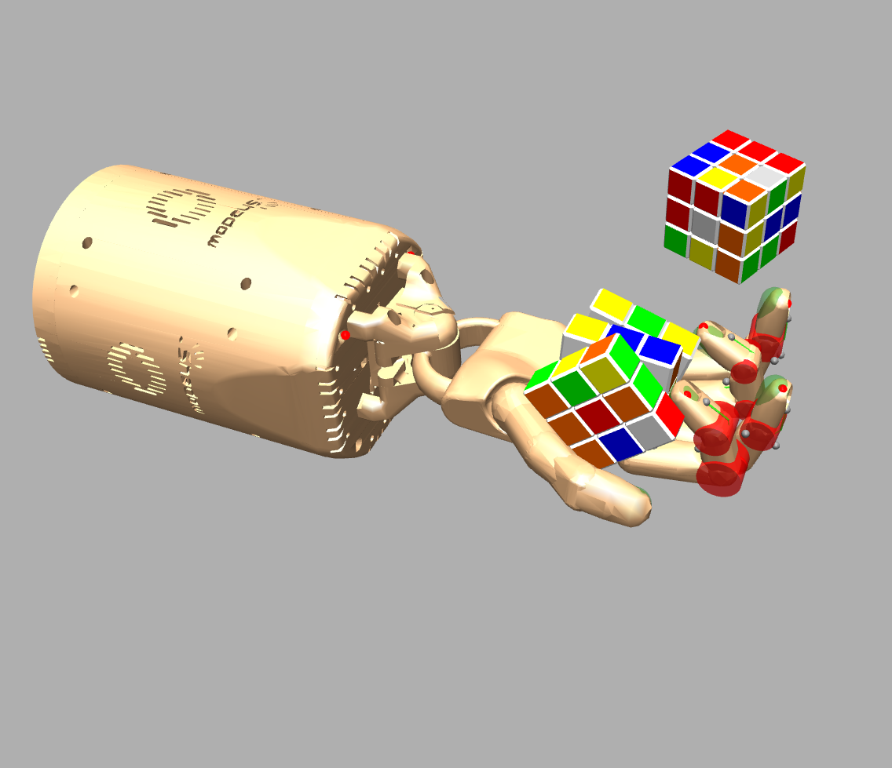
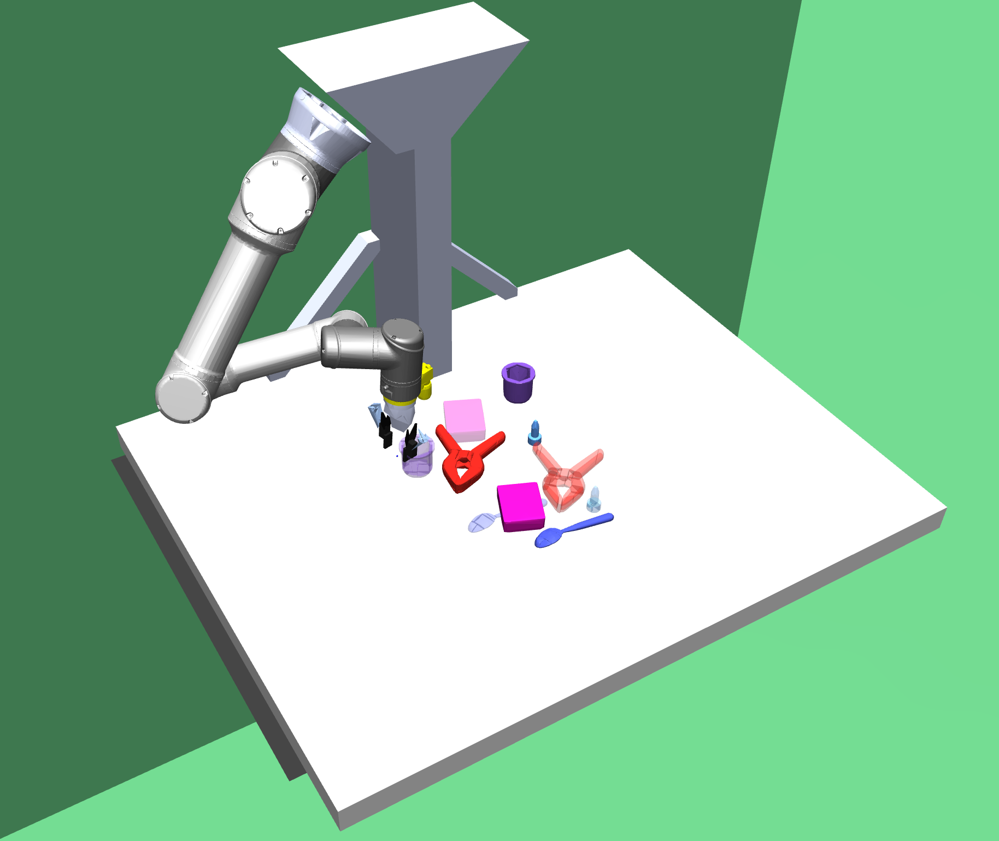
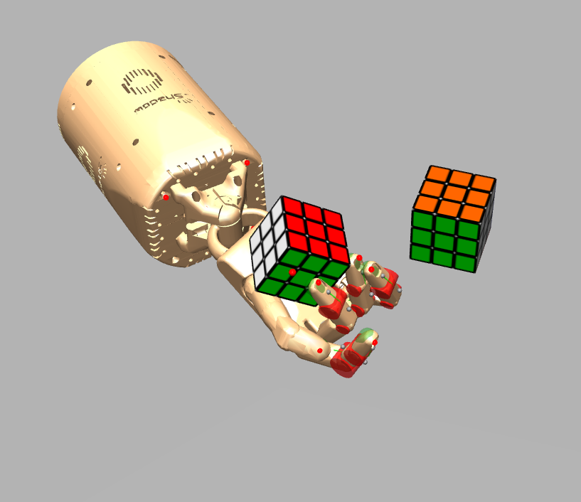
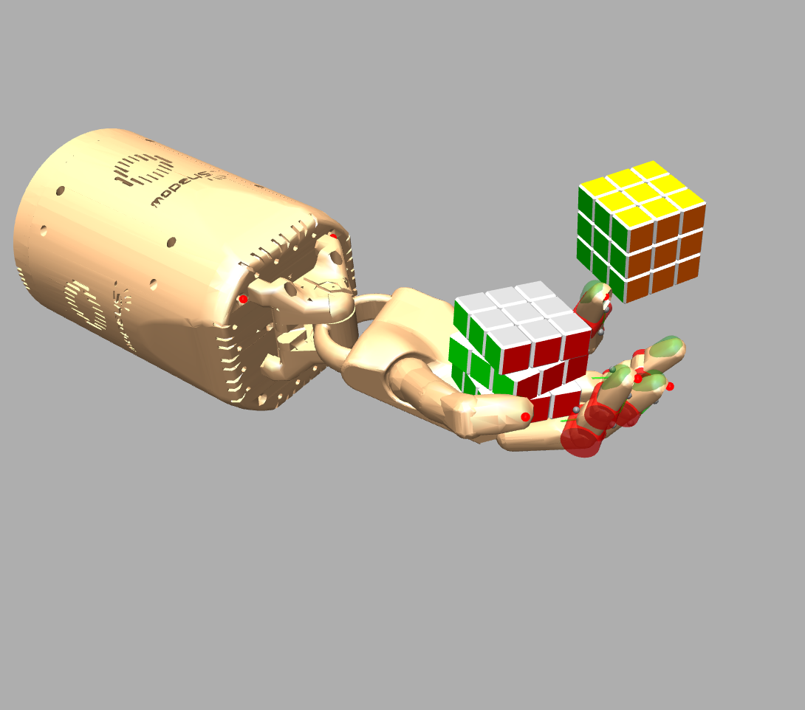
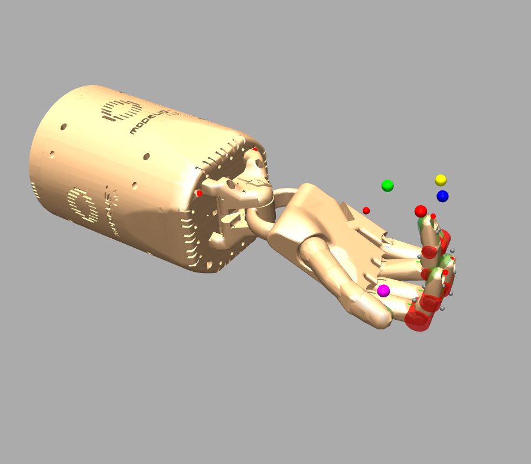
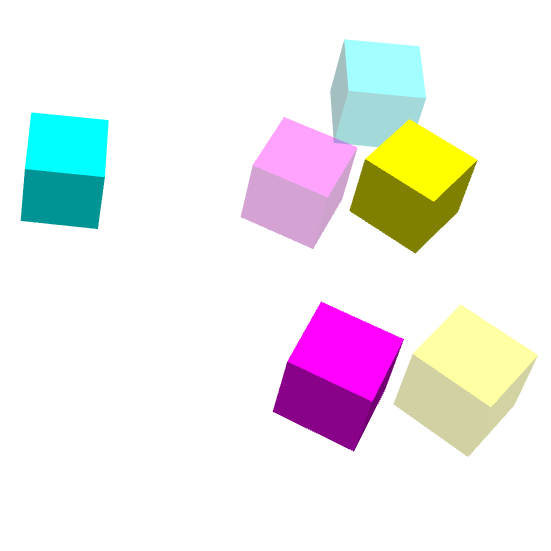
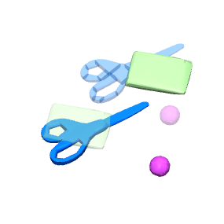
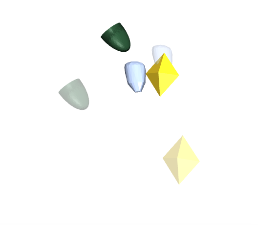
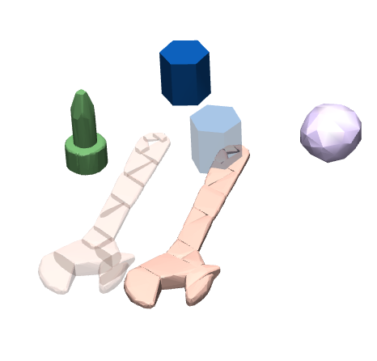
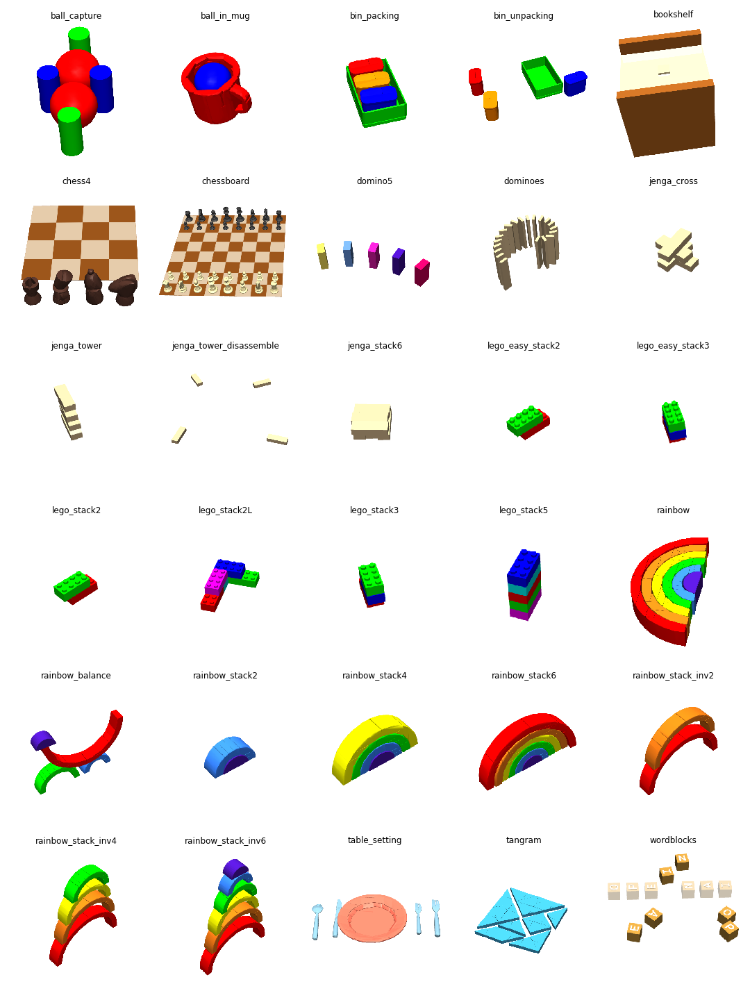

**Status**: Archive (code is provided as-is, no updates expected)

# Robogym

robogym is a simulation framework that uses [OpenAI gym](https://gym.openai.com/) and [MuJoCo physics simulator](http://mujoco.org/) and provides a variety of robotics environments suited for robot learning in diverse settings.

<p align="center">
     &nbsp; 
</p>

##  Supported Platforms

This package has been tested on Mac OS Mojave, Catalina and Ubuntu 16.04 LTS, and is probably fine for most recent Mac and Linux operating systems.

Requires **Python 3.7.4 or greater**.

## Installation


1.  Install MuJoCo by following the [instructions](https://github.com/openai/mujoco-py#install-mujoco) from the `mujoco-py` package.

2.  To checkout the code and install it, via `pip install`, run:

    ```bash
    git clone git@github.com:openai/robogym.git
    cd robogym
    pip install -e .
    ```

    Or you can install it directly via:

    ```bash
    pip install git+https://github.com/openai/robogym.git
    ```

## Citation

Please use the below BibTeX entry to cite this framework:

```
@misc{robogym2020,
  author={OpenAI},
  title={{Robogym}},
  year={2020},
  howpublished="\url{https://github.com/openai/robogym}",
}
```

# Usage

## Visualizing Environments

You can visualize and interact with an environment using ```robogym/scripts/examine.py```.

For example, following scripts visualize the `dactyl/locked.py` environment.

```bash
python robogym/scripts/examine.py robogym/envs/dactyl/locked.py constants='@{"randomize": True}'
```

Note that `constants='@{"randomize": True}` is an argument to set constants for the environment.

Similarly, you can set parameters of an environment as well. Below shows a command for
 visualizing a block rearrange environment with 5 objects.

```bash
python robogym/scripts/examine.py robogym/envs/rearrange/blocks.py parameters='@{"simulation_params": {"num_objects": 5}}'
```

We support teleoperation for the rearrange environments via the `--teleoperate` option, which allows users to interact with
 an environment by controlling the robot with a keyboard.
Below is an example command for the teleoperation.

```bash
python robogym/scripts/examine.py robogym/envs/rearrange/blocks.py parameters='@{"simulation_params": {"num_objects": 5}}' --teleoperate
```

Hold-out environments that are specified via a `jsonnet` config can also be visualized and teleoperated using this mechanism as below

```bash
python robogym/scripts/examine.py robogym/envs/rearrange/holdouts/configs/rainbow.jsonnet  --teleoperate
```

## Creating Python environments

The environments extend OpenAI gym and support the reinforcement learning interface offered by gym, including `step`, `reset`, `render` and `observe` methods.

All environment implementations are under the `robogym.envs` module and can be instantiated by calling the `make_env`  function. For example, the following code snippet creates a default locked cube environment:

```python
from robogym.envs.dactyl.locked import make_env
env = make_env()
```

See the section on [customization](#customizing-robotics-environments) for details on how to customize an environment.

# Environments

All the environment classes are subclasses of `robogym.robot_env.RobotEnv`. The classmethod `RobotEnv.build` is the main entry point for constructing an environment object, pointed by `make_env` in each environment. Customized parameters and constants should be defined by subclasses of `RobotEnvParameters` and `RobotEnvConstants`.

The physics and simulator setup are wrapped within `robogym.mujoco.simulation_interface.SimulationInterface`. There is a 1-1 mapping between one instance of `SimulationInterface` and one instance of `RobotEnv`.

Each environment contains a `robot` object accessible via `env.robot` that implements the [`RobotInterface`](robogym/robot/robot_interface.py).

## Training / Testing Environments

### Dactyl Environments

Dactyl environments utilize a Shadow Robot hand robot simulation with 20 actuated degrees of freedom to perform in-hand manipulation tasks. Below is a full list of environments provided in this category:

|Image|Name|Description|
|----------|:-------------|:-------------|
||dactyl/locked.py| Manipulate a locked cube with no internal  degrees of freedom to match a target pose|
||dactyl/face_perpendicular.py|Manipulate a Rubik's cube with 2 internal degrees of freedom to match a target pose and face angles|
||dactyl/full_perpendicular.py|Manipulate a Rubik's cube with full internal 6 degrees of freedom to match a target pose and face angles|
||dactyl/reach.py|Reach task for fingertip target positions|

### Rearrange Environments

These environments are based on a UR16e robot equipped with a RobotIQ 2f-85 gripper that is able to rearrange a variety of object distributions in a tabletop setting. Several different types of robot control modes are supported as detailed [here](robogym/robot/README.md).
<p align="center">

</p>

Various goal generators are provided to enable different tasks such as `stack`, `pick-and-place`, `reach` and `rearrange` to be specified on a given object distribution.
List of all rearrange environments and their configs are described in
[this document](./docs/list_rearrange_env.md).

Below is a list of object distributions supported in this category:

|Image|Name|Description|
|----------|:-------------|:-------------|
||rearrange/blocks.py|Samples blocks of different colors|
||rearrange/ycb.py|Samples from [YCB](https://www.ycbbenchmarks.com/) objects|
||rearrange/composer.py|Samples objects that are composed of random meshes that are either basic geom shapes or random convex meshes (decomposed YCB objects)|
||rearrange/mixture.py|Generates objects from a mixture of mesh object distributions (supports ycb/geom mesh datasets)|

For rearrange environments, we also provide a variety of hold-out tasks that are typically used for evaluation purposes. The goal states of various hold-out environments can be seen in the image grid below.
<p align="center">

</p>

## Customizing Robotics Environments

Most robotics environments support customization by providing additional parameters via `constant`
argument to `make_env`, you can find which constants are supported by each environment by looking
into definition of `<EnvName>Constants` class which usually lives under the same file as `make_env`.
Some commonly supported constants are:

- `randomize`: If true, some randomization will be applied to physics, actions and observations.
- `mujoco_substeps`: Number of substeps per step for mujoco simulation which can be used to balance between simulation accuracy and training speed.
- `max_timesteps_per_goal`: Max number of timesteps allowed to achieve each goal before timeout.

Similarly, there are `parameters` arguments, which can be customized together with `constants`.
You can find which parameters are supported by each environment by looking into definition of
 `<EnvName>Parameters`.

Below is the default settings that we use to train most of the robotics environments:

```python
env = make_env(
    constants={
        'randomize': True,
        'mujoco_substeps': 10,
        'max_timesteps_per_goal': 400
    },
    parameters={
        'n_random_initial_steps': 10,
    }
)
```

## Interface for Environment Randomization

Robogym provides a way to intervene the environment parameters during training to support domain randomization and curriculum learning.

Below shows an example of intervening the number of objects for blocks (rearrange) environment.
You can use this interface to define a curriculum over the number of objects:

```python
from robogym.envs.rearrange.blocks import make_env

# Create an environment with the default number of objects: 5
env = make_env(
    parameters={
        'simulation_params': {
            'num_objects': 5,
            'max_num_objects': 8,
        }
    }
)

# Acquire number of objects parameter interface
param = env.unwrapped.randomization.get_parameter("parameters:num_objects")

# Set num_objects: 3 for the next episode
param.set_value(3)

# Reset to randomly generate an environment with `num_objects: 3`
obs = env.reset()
```

See the document on ["Interface for Environment Randomization"](docs/env_param_interface.md) for more details.

## Create New Rearrange Environments

We provide a set of tools to help create a customized rearrange environment via teleoperation.

See the document on ["Build New Rearrange Environments"](docs/build_new_rearrange_envs.md) for more details.
